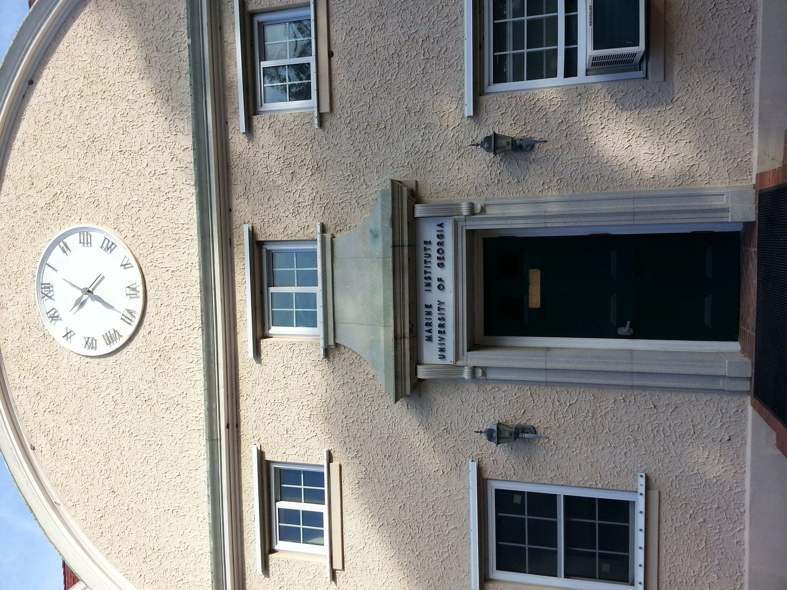
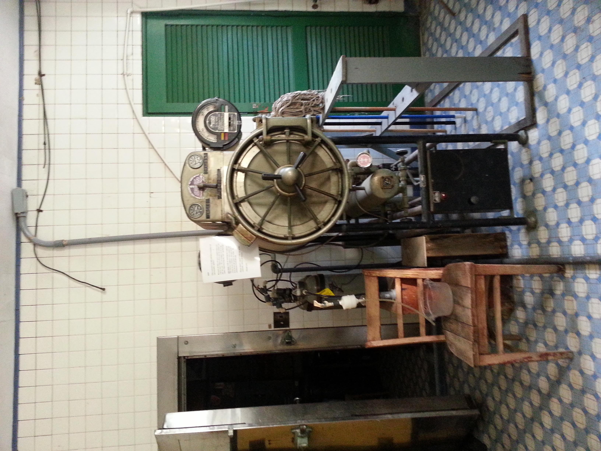
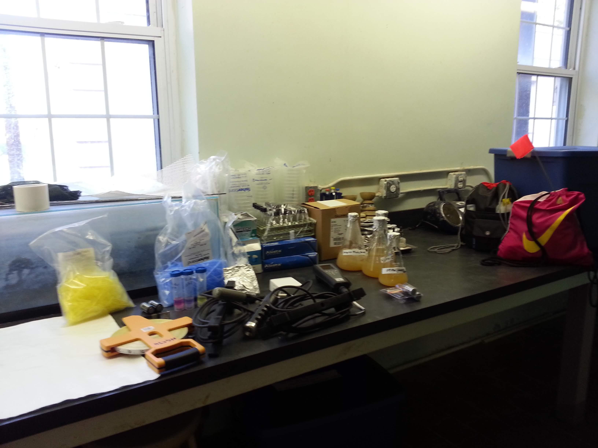
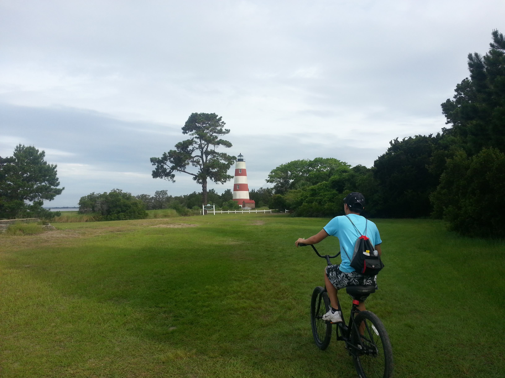
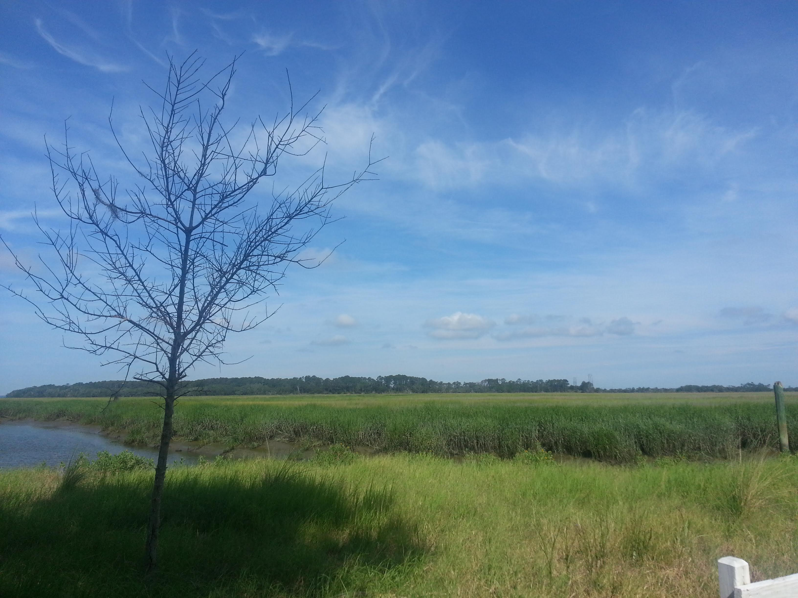
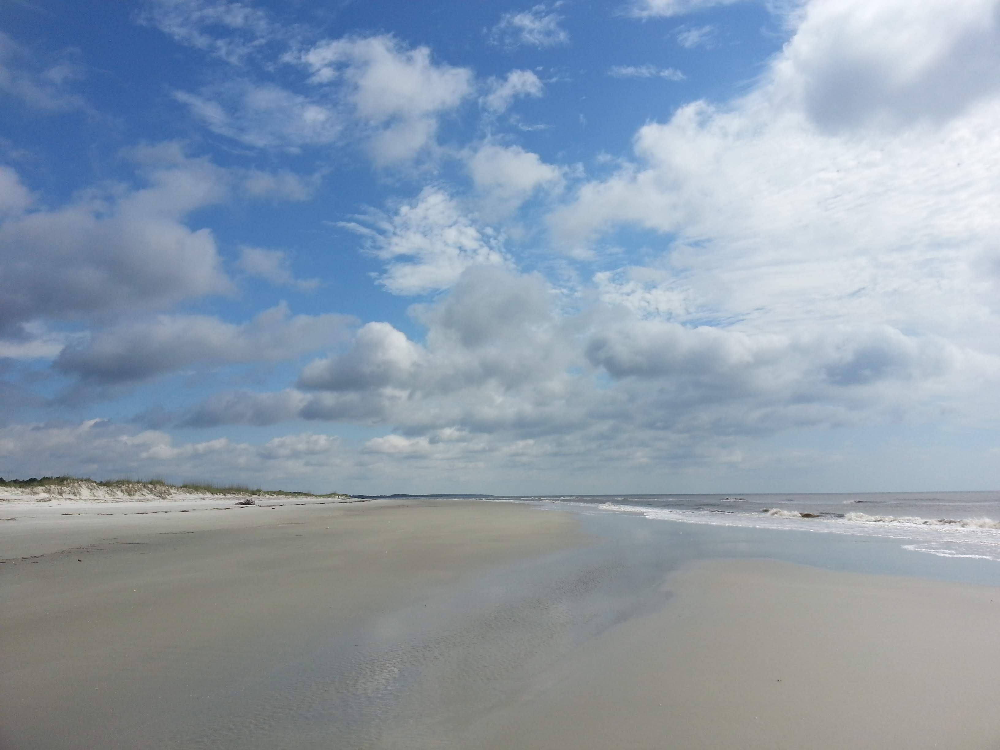
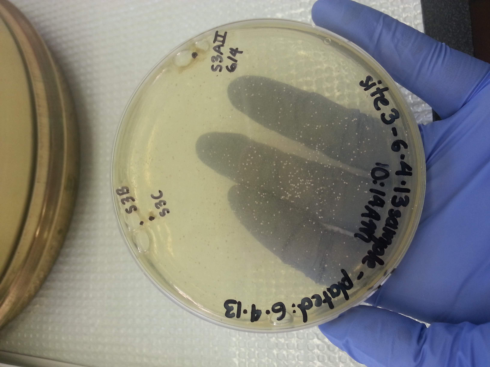
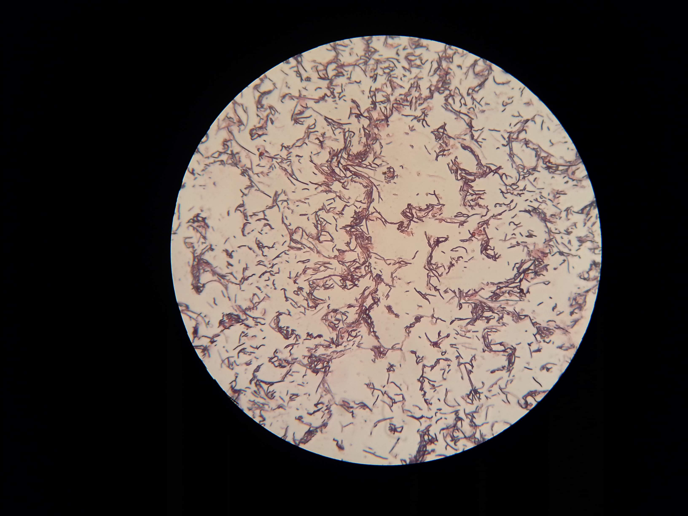
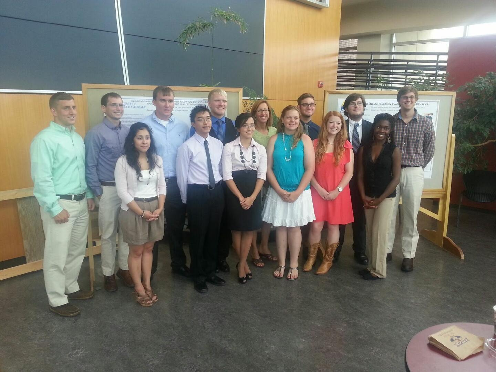

I went to Sapelo Island for my field research course offered through the University of North Georgia- Dahlonega Department of Biology. It was one of the most fun courses I took!

It taught me about planning for research activities in a resource-limited setting. When you're working in a modern laboratory, you don't have to think about all the materials and equipments you use on a day-to-day basis. On the island, we are more than 5 hours drive and a ferry ride away from the closest laboratory. We had to bring everything we though we would need!

I worked with my twin sister, Lynn, and one other student on a project to profile the abundance and diversity of halophiles on the salt pans around the island. If time allowed, we also wanted to answer what are some enviromental factors that affect the abundance and diversity of these salt pan halophiles.

On day 1, we went straight to work because we new isolating new organisms on agar can take quite a while and we didn't want to come back empty handed. We got to work at the UGA Marine Institute (pictured below), which was conveniently located right next to our housing.



We made our agar using the oldest autoclave I have ever seen. It takes half the day to run!


Here is our bench space!


Once the agar was set. It was time for us to go to our field site to isolate some halophiles! For most of our stay we traveled by golf cart or by bike.



You can see an example of a salt pan in the distance in this picture:



Once we obtained our salt flat sediments and spread it onto our agar plates, we were able to relax some while the microbes were incubating. The weather was beautiful and we got to enjoy a lot of time on the beach!



After 6 days of incubation, we finaly had colony growth!



We were even able to gram stain the colonies on site.




While we weren't able to sample enough site for quantitative analyses, we found that salt pans further away from a freshwater source had higher salinity and increased abundance and diversity of halophiles compared to sites closer to a freshwater source.

Here is a picture of the group of us that took the field research class that summer:


Block of code:

```JavaScript
  const thisIsATest = () => {
    console.log("This is funny")
  }
```

